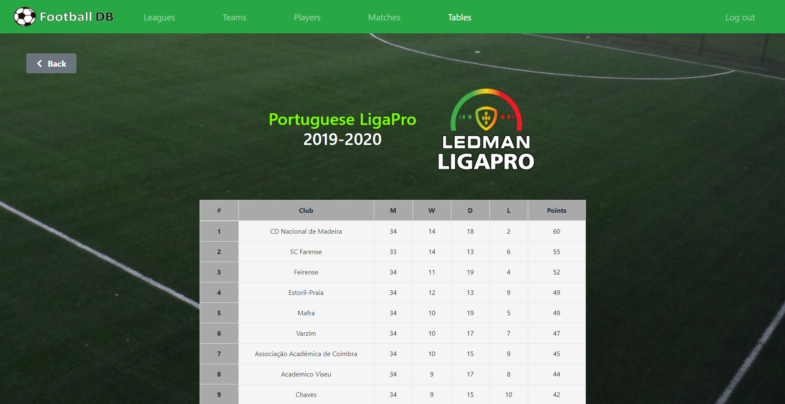
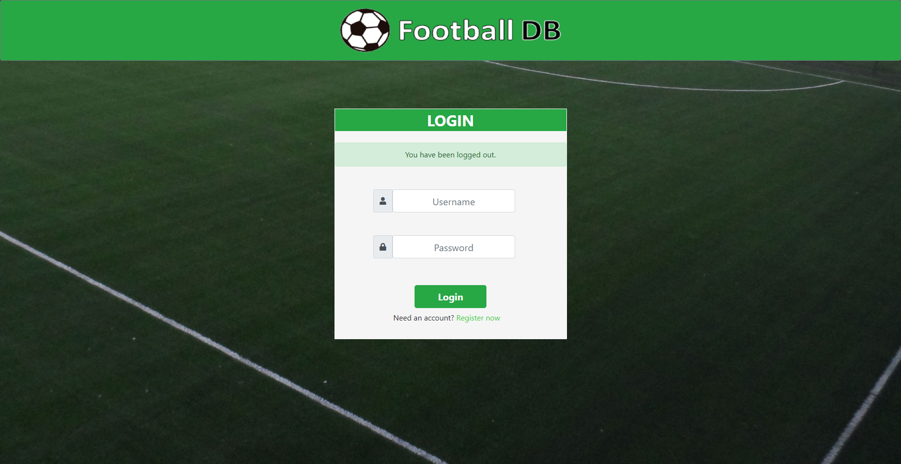

# Football-DB
Web application for searching all information about football based on external API - [TheSportsDB](https://www.thesportsdb.com/api.php).

## Table of contents
* [Features](#features)
* [Screenshots](#screenshots)
* [Technologies](#technologies)
* [Todos](#todos)
* [Author](#author)

## Features
1. Search for:
    * leagues by:
        - country
        - name
    * teams by:
        - country
        - league name
        - team name
    * players by:
         - name
         - team and name
    * matches by:
         - home and away team
         - home, away team and season
    * tables by:
         - league name
         - season
         
2. login and user registration
3. validation if:
    - input fields are empty
    - book, user already exist in database
    - username, password are correct

## Screenshots

###### SEARCH
   
   
###### HOME
   
###### LEAGUE
   
   
   
   
###### TEAM
   
   
   
   
###### PLAYER
   
   
   
###### MATCH
   
###### TABLE
   
###### USER LOGIN AND REGISTRATION
   
 

## Technologies
* Java - v11
* Spring Boot - v2.3.4
* Spring Data JPA
* Spring Security
* Spring MVC
* MySQL - v8.0.21
* Thymeleaf
* Maven - v3.6.3
* Junit - v5.6.2
* Mockito - v3.3.3
* HTML
* CSS
* Bootstrap - v4.5.2

## Todos
* upgrade API key to a paid version
* add: 
    - statistics to matches
    - previous and upcoming matches for teams
    - live scores
    
## Author
Adrian Bloch